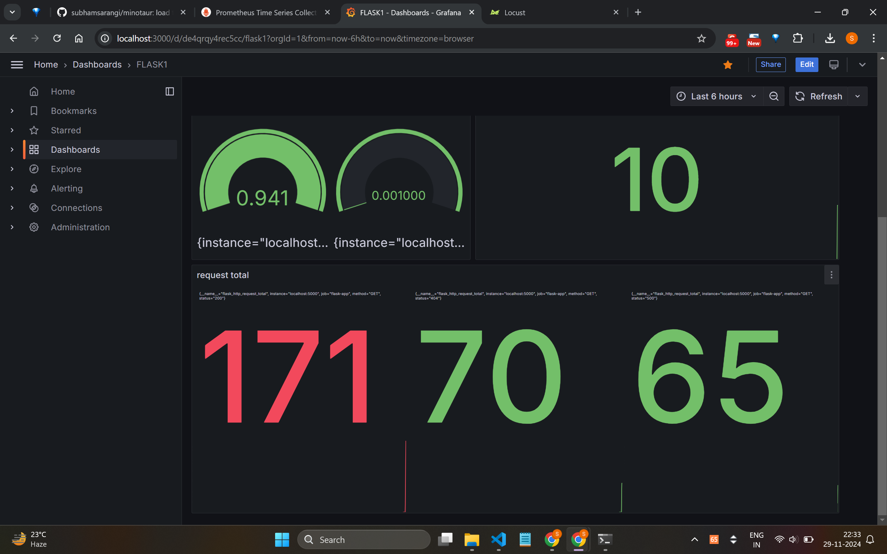
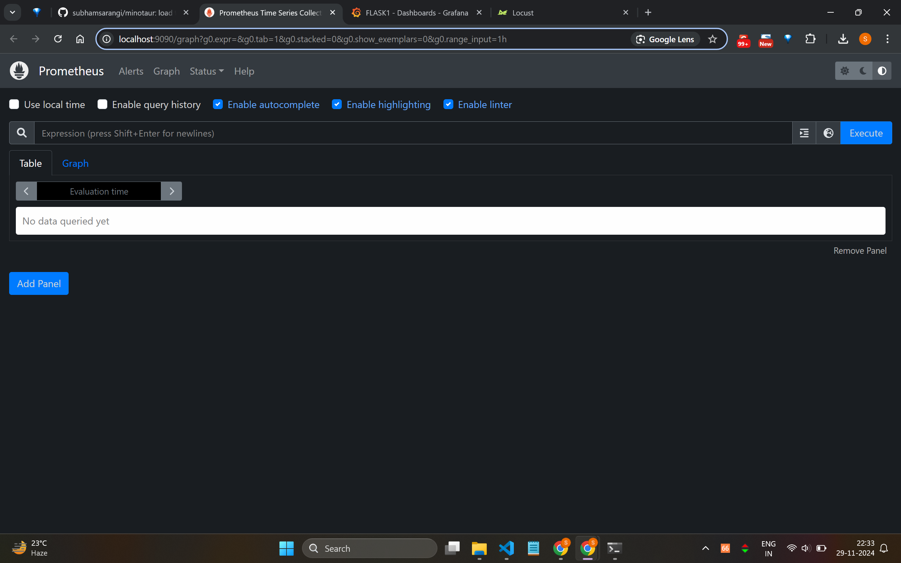
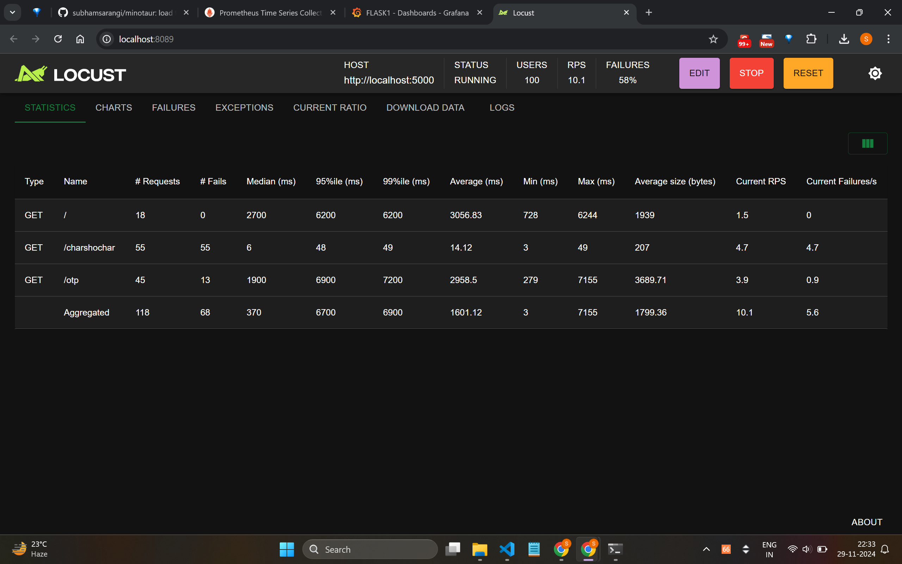

# minotaur
## flask, prometheus, grafana, locust
## load testing, monitoring

# user guide
## run flask server

    `python app.py`

### check in browser at http://localhost:5000

## run proemtheus

### run it directly
    `/home/homelander/minotaur/prometheus-2.40.0.linux-amd64/prometheus --config.file=/home/homelander/minotaur/prometheus-2.40.0.linux-amd64/prometheus.yml`

### make a prometheus systemd service
- Create a systemd service file:
    ```
    [Unit]
    Description=Prometheus
    After=network.target

    [Service]
    ExecStart=/home/user1/minotaur/prometheus-2.40.0.linux-amd64/prometheus --config.file=/home/user1/minotaur/prometheus-2.40.0.linux-amd64/prometheus.yml
    Restart=always
    User=user1
    Group=user1
    ExecReload=/bin/kill -HUP $MAINPID
    KillMode=mixed
    KillSignal=SIGINT

    [Install]
    WantedBy=multi-user.target
    ```

- Reload systemd to pick up the new service: After creating the service file, reload systemd:

    `sudo systemctl daemon-reload`

- Start the Prometheus service: Start Prometheus using the systemd service:

    `sudo systemctl start prometheus`

- Enable Prometheus to start on boot: To make Prometheus start automatically when the system boots:

    `sudo systemctl enable prometheus`

- Check the status of Prometheus: To see if Prometheus is running properly:

    `sudo systemctl status prometheus`

- Stop Prometheus: To stop the Prometheus service:

    `sudo systemctl stop prometheus`

### check in browser at http://localhost:9090


## run grafana
    `sudo systemctl start grafana-server`

### check in browser at http://localhost:3000

#### login using admin and admin

#### import a json or make a new dashboard

## run locust

    `locust -f locustfile.py`

### check in browser at http://localhost:8089

## results




